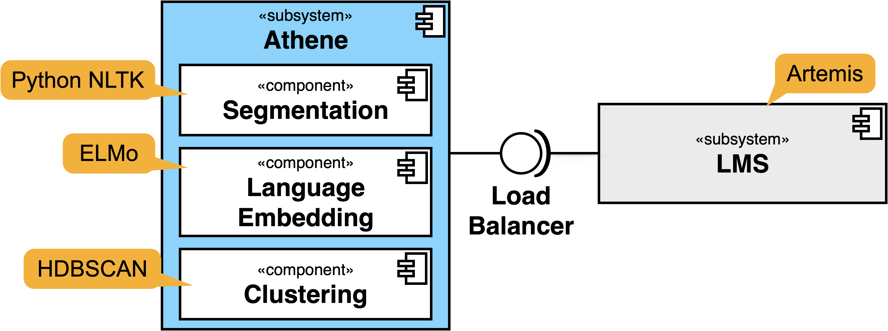

# Athene: A system to support (semi-)automated assessment of textual exercises

This system implements an approach for (semi-)automated assessment of textual exercises and can be integrated into learning management systems (LMS). A reference integration exists for the LMS [Artemis](https://github.com/ls1intum/Artemis).

Athene implements the approach described in our paper *Toward the Automatic Assessment of Text Exercises*:

> Jan Philip Bernius and Bernd Bruegge. 2019. **Toward the Automatic Assessment of Text Exercises**. In *2nd Workshop on Innovative Software Engineering Education (ISEE)*. Stuttgart, Germany, 19–22. [\[pdf\]](https://brn.is/isee19)

## Architecture

The Athene system is built using a microservice architecture, as depicted in Figure 1.
Four components comprise the Athene system:



<p align="center"><b>Figure 1:</b> Athene Microservice Architectuer depicted using a UML Component diagram.</p>

1.  **Load Balancer:** Provides Service in the form of a HTTP REST API to submit an Athene job. This component will manage the work distribution to other components.
2.  **Segmentation:** Component for segmenting Student Answers based on Topic Modeling.
3.  Language **Embedding:** Component for computing Language Embeddings using ELMo and uploading training material for ELMo.
4.  **Clustering:** Component for clustering of ELMo Vectors using HDBSCAN.

The load balancer orchestrates jobs and calls all components using their HTTP APIs.
After the job is completed, it calls back to LMS to submit the results.

## Basic Usage

### Running with Docker

Using the `docker-compose.yml` file included in the root directory of the repository is the easiest way to start Athene.

The execution of

    docker-compose up -d

will automatically build and start the Load-balancer, Segmentation, the Embedding and the Clustering component (The `-d` parameter will run containers in the background, omit it to directly see outputs).

The first time you start Athene, it will take a while to download all required images and build the components.

For testing and development purposes, a single component can be re-built using e.g.

    docker-compose build segmentation

or be started separately (in foreground mdoe) using e.g.

    docker-compose up segmentation

Stopping Athene can be achieved by stopping the running containers using

    docker-compose down

For further information have a look at the [Compose file reference](https://docs.docker.com/compose/compose-file/) and the [Compose command-line reference](https://docs.docker.com/compose/reference/overview/).

### Running the Services Using make

Prepare all local dependencies and start the services by running

```bash
make -j6 # j6 is optional, but speeds up the process
```

in the root directory.
This will call `make` in all subdirectories,
which initializes virtual environments,
installs dependencies and downloads required models.
After that the services will be started automatically.

There is one special target in the `Makefile` that will start traefik and the MongoDB database in a docker container
to redirect to the services running on your local machine.

You can always just directly use `make` and it will automatically detect changed dependencies.

### Running the Services Using PyCharm

If you are using PyCharm, you can configure the project as follows:

1.  Open the project in PyCharm

2.  Ensure that you have the [EnvFile plugin](https://plugins.jetbrains.com/plugin/7861-envfile) installed so that the environment file loading can take place from the run configuration.

3.  Run the setup preparations by running `make setup` in a terminal or by using the run configuration `Prepare local setup`

4.  Now, you can add the different microservices as submodules of the PyCharm project. To do so, go to `File -> Open` and open the following directories. When asked, choose to open them using the "Attach" method (in the dialog that also provides options for "This window" / "New window").
    \- `clustering`
    \- `embedding`
    \- `load-balancer`
    \- `segmentation`
    \- `tracking`

5.  Configure the virtual environment Python interpreters for the different modules: For each of the modules in the list above, go to `File -> Settings -> Project: Athene -> Project Interpreter` and select the virtual environment in the `.venv` directory of the respective module.

6.  Now, you can start the different services by running the corresponding run configurations. This has the added advantage that you can debug the services directly from PyCharm by running the configuration in debug mode. You can also start all services by running the `All Services`-configuration.

### Notes on Running the Services Without Docker

Running the services directly has multiple advantages:

*   You can use the Debug-Mode of your IDE to debug the services
*   You can restart the services individually without restarting the whole system
*   The services will restart themselves if you change the code (the uvicorn-reloader is enabled by default)

Using makefiles or PyCharm will use the environment variables from `.local.env`.

You can remove all the setup files by running `make clean`.

## Basic API Overview

By default, a traefik-container will manage API-Endpoints and expose them on port 80 (default HTTP-port).
The following API-routes are available after start:

*   <http://localhost/submit> - For Artemis to submit a job to the load-balancer
*   <http://localhost/queueStatus> - To monitor the queue status of the load balancer
*   <http://localhost/getTask> - For the computation components to query tasks from the load balancer
*   <http://localhost/sendTaskResult> - For the computation components to send back results to the load balancer
*   <http://localhost/upload> - For Artemis to upload course material
*   <http://localhost/tracking> - For Artemis to access tracking functionality
*   <http://localhost/feedback_consistency> - For Artemis to access feedback\_consistency functionality

Traefik provides a dashboard to monitor the status of underlying components.
This dashboard is available on <http://localhost:9081/dashboard> by default.

## Configuration

For configuration of the Athene system you can make use of the `.env`-file in the repository. All variables in there are used in the `docker-compose.yml` to bring up the Athene system.

## Contributing

We welcome contributions in any form! Assistance with documentation and tests is always welcome. Please submit a pull request.

## Citing

To reference the automatic assessment approach developed in this system please cite our paper in ISEE 2019 proceedings.

```bibtex
@inproceedings{BerniusB19,
  title     = {Toward the Automatic Assessment of Text Exercises},
  author    = {Jan Philip Bernius and Bernd Bruegge},
  booktitle = {2nd Workshop on Innovative Software Engineering Education (ISEE)},
  address   = {Stuttgart, Germany},
  year      = {2019},
  pages     = {19--22},
  url       = {http://ceur-ws.org/Vol-2308/isee2019paper04.pdf}
}
```
